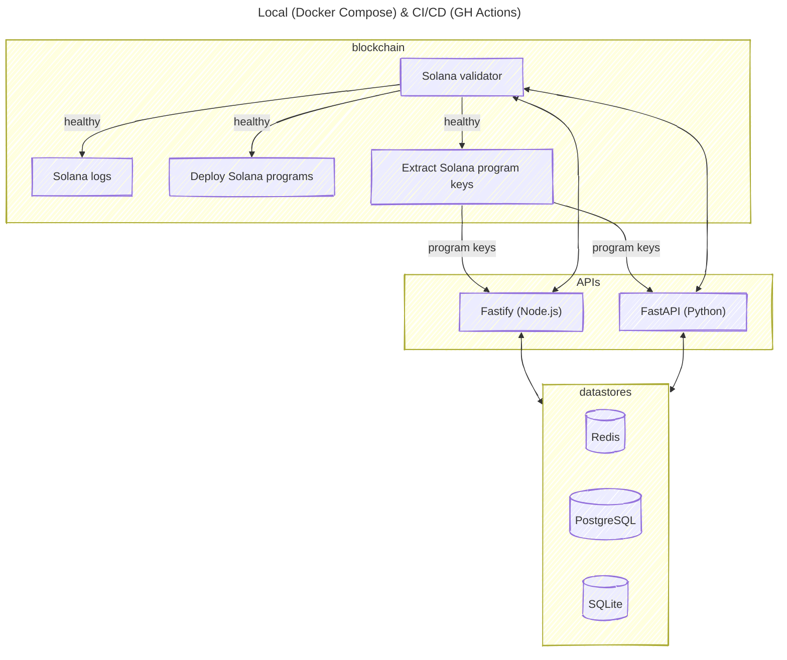
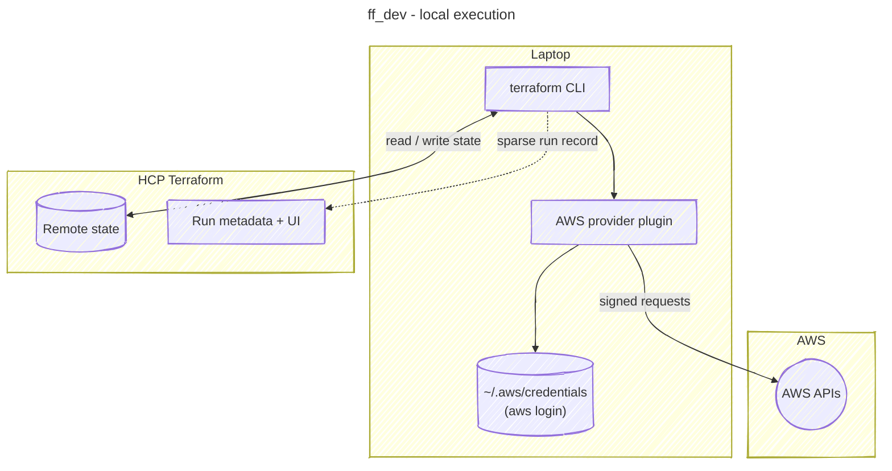
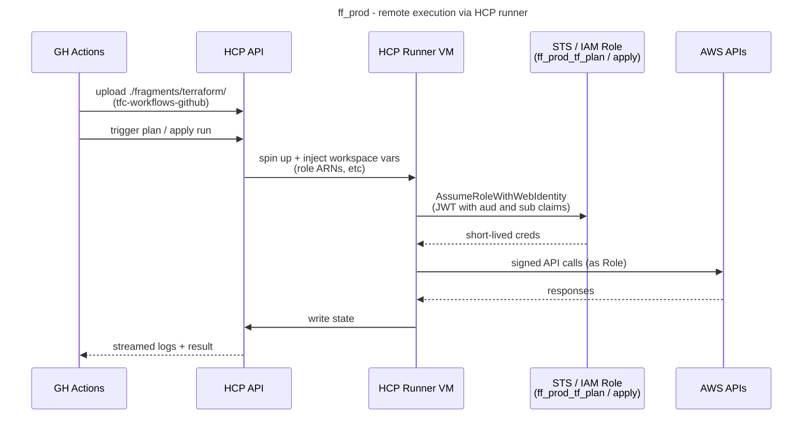

# ff

A collection of educational code samples for comparison. Core fragments are implemented in Node.js and Python.
Blockchain programs are written in Rust (Solana/Anchor).

Every code sample is mirrored in each language, and each one implements these basic code quality tasks:

- Unit testing
- Linting
- Building / compiling, if applicable
- Formatting
- Type checking

Every sample can be run locally - see [Running the code](#running-the-code). Docker images are available for running the
APIs only.

## Architecture



> [!NOTE]
> The above graph assumes everything is running. See [Running the code](#running-the-code) for other options.

## Code contents

| Fragment                       | Link                                                              | Node.js | Python | Rust |
| ------------------------------ | ----------------------------------------------------------------- | :-----: | :----: | :--: |
| **Core**                       |                                                                   |         |        |      |
| Environment variables          | [`env_vars`](./fragments/env_vars/)                               |   ✅    |   ✅   |      |
| SQLite                         | [`sqlite_db`](./fragments/sqlite_db/)                             |   ✅    |   ✅   |      |
| Redis                          | [`redis_db`](./fragments/redis_db/)                               |   ✅    |   ✅   |      |
| PostgreSQL                     | [`postgres_db`](./fragments/postgres_db/)                         |   ✅    |   ✅   |      |
| REST APIs                      | [`apis`](./fragments/apis/)                                       |   ✅    |   ✅   |      |
| **Solana (client-side)**       |                                                                   |         |        |      |
| RPC clients                    | [`solana_rpc`](./fragments/solana_rpc/)                           |   ✅    |   ✅   |      |
| Balance                        | [`solana_balance`](./fragments/solana_balance/)                   |   ✅    |   ✅   |      |
| Airdrops                       | [`solana_airdrop`](./fragments/solana_airdrop/)                   |   ✅    |   ✅   |      |
| Transactions                   | [`solana_transaction`](./fragments/solana_transaction/)           |   ✅    |   ✅   |      |
| Program utils                  | [`solana_program`](./fragments/solana_program/)                   |   ✅    |   ✅   |      |
| Program: Counter               | [`solana_program_counter`](./fragments/solana_program_counter/)   |   ✅    |   ✅   |      |
| Program: Username              | [`solana_program_username`](./fragments/solana_program_username/) |   ✅    |   ✅   |      |
| Program: Round                 | [`solana_program_round`](./fragments/solana_program_round/)       |   ✅    |   ✅   |      |
| Program: Register              | [`solana_program_register`](./fragments/solana_program_register/) |   ✅    |   ✅   |      |
| **Solana (on-chain programs)** |                                                                   |         |        |      |
| Counter                        | [`counter`](./fragments/blockchain/solana/programs/counter)       |         |        |  ✅  |
| Username                       | [`username`](./fragments/blockchain/solana/programs/username)     |         |        |  ✅  |
| Round                          | [`round`](./fragments/blockchain/solana/programs/round)           |         |        |  ✅  |
| Register                       | [`register`](./fragments/blockchain/solana/programs/register)     |         |        |  ✅  |
| **AWS IaC**                    |                                                                   |         |        |      |
| Terraform (HCP backend)        | [`terraform`](./fragments/terraform/)                             |         |        |      |

## Running the code

Each programming language supports local environment setup for development. Docker images are provided for running the
APIs.

Some core fragments expect services to be running on particular ports, such as Redis. Blockchain fragments also expect
some services to be running, such as node validators.

The easiest way to provision your local environment with the required services is through the provided Docker Compose
setup. You'll need [Docker](https://www.docker.com/get-started/) installed and running.

Spin up all the services before running any commands:

```
docker compose --profile blockchain up
```

> [!NOTE]
> After `docker compose --profile blockchain up` has run, the Solana program keys are automatically extracted to
> `./solana_program_keys/solana_program_keys.env`. In addition, the Solana deployer keypair is automatically extracted
> to `./solana_program_keys/solana_deployer.json`. They are dynamically referenced in unit tests.

If not working on blockchain fragments, you can omit the `blockchain` profile to save on CPU consumption:

```
docker compose up
```

To run the APIs via Docker Compose, use the `api` profile:

```
docker compose --profile api up
```

Or combine with the `blockchain` profile so the APIs have access to the Solana programs:

```
docker compose --profile api --profile blockchain up
```

### Node.js

All the Node.js code is written in TypeScript and uses [`tsx`](https://www.npmjs.com/package/tsx) to transpile and
execute the code.

#### Local (Node.js)

##### Setup

- Install [`fnm`](https://github.com/Schniz/fnm)
- `fnm install`. This installs and uses the version specified in [`.node-version`](./.node-version)
- Run `npm ci` at root of repo
- Install [`dvm`](https://deno.land/x/dvm). Used for linting and formatting with deno
- `dvm install 2.1.6` if you don't already have this version
- `dvm use 2.1.6`

##### Run

- Run unit tests:
  ```
  node --run test
  ```
- Run the linter:
  ```
  node --run lint
  ```
- Run the TypeScript check:
  ```
  node --run tsc
  ```
- Run the formatter:
  ```
  node --run format:write
  ```
- Run the format check:
  ```
  node --run format:check
  ```
- Run the REST API (in watch mode):
  ```
  node --run api
  node --run api:dev
  ```
- Run the REST API build:
  ```
  node --run api:build
  ```
- Run the Bruno integration tests (ensure the API is already running):
  ```
  node --run api:bru:fastify
  ```

#### Docker (Node.js)

- Build the image at root of repo (with optional build args):
  ```
  docker build \
    --force-rm \
    --build-arg NODE_VERSION=22 \
    -f docker.node.Dockerfile \
    -t ff_node .
  ```
- Run the REST API:
  ```
  docker run --rm \
    --network ff_default \
    --name fastify \
    -p 3000:3000 \
    -v "$(pwd)/solana_program_keys/solana_deployer.json:/usr/src/app/solana_program_keys/solana_deployer.json:ro" \
    -e FASTIFY_HOST=0.0.0.0 \
    -e POSTGRES_HOST=postgres \
    -e REDIS_HOST=redis \
    -e SOLANA_HOST=solana \
    $( [ -f ./solana_program_keys/solana_program_keys.env ] && echo "--env-file ./solana_program_keys/solana_program_keys.env" ) \
    ff_node
  ```

### Python

#### Local (Python)

##### Setup

- Install [`uv`](https://docs.astral.sh/uv/getting-started/installation)
- Run `uv sync` at root of repo. This installs the Python version specified in `pyproject.toml`, creates the virtual
  environment, and installs all dependencies

##### Run

> [!IMPORTANT]
> The Bruno commands require the local Node.js setup, see earlier instructions.

- Run unit tests:
  ```
  uv run python -m unittest -v
  ```
- Run specific unit test suite:
  ```
  uv run python -m unittest -v fragments/solana_program_counter/test_solana_counter_interface.py
  ```
- Run the type check:
  ```
  uv run mypy
  ```
- Run the linter:
  ```
  uv run pylint ./fragments
  ```
- Run the formatter:
  ```
  uv run ruff format ./fragments
  ```
- Run the format check:
  ```
  uv run ruff format --check ./fragments
  ```
- Run the REST API:
  ```
  uv run python -m fragments.api
  ```
- Run the Bruno integration tests (ensure the API is already running):
  ```
  node --run api:bru:fastapi
  ```

#### Docker (Python)

- Build the image at root of repo (with optional build args):
  ```
  docker build \
    --force-rm \
    --build-arg PYTHON_VERSION=3.12.4 \
    -f docker.python.Dockerfile \
    -t ff_python .
  ```
- Run the REST API:
  ```
  docker run --rm \
    --network ff_default \
    --name fastapi \
    -p 3003:3003 \
    -v "$(pwd)/solana_program_keys/solana_deployer.json:/usr/src/app/solana_program_keys/solana_deployer.json:ro" \
    -e FASTAPI_HOST=0.0.0.0 \
    -e POSTGRES_HOST=postgres \
    -e REDIS_HOST=redis \
    -e SOLANA_HOST=solana \
    $( [ -f ./solana_program_keys/solana_program_keys.env ] && echo "--env-file ./solana_program_keys/solana_program_keys.env" ) \
    ff_python
  ```

### Solana

#### Local (Solana)

Solana programs are written in Rust. Install [rustup](https://www.rust-lang.org/tools/install) if you haven't already.

> [!NOTE]
> All `cargo` commands under `./fragments/blockchain/solana/` will use the Rust version and components as specified in
> [`./fragments/blockchain/solana/rust-toolchain.toml`](./fragments/blockchain/solana/rust-toolchain.toml)

##### Setup

- If not on macOS, check the [official docs](https://solana.com/docs/intro/installation) for any extra steps before
  continuing
- Install [Solana CLI](https://docs.anza.xyz/cli/install/) version `3.1.9`. For macOS:
  ```
  sh -c "$(curl -sSfL https://release.anza.xyz/v3.1.9/install)"
  ```
- Ensure you follow the instructions to add the `solana` executable to your `PATH`
- Run `solana --version` to confirm the installation
- Install [`anchor`](https://www.anchor-lang.com/docs/installation):
  ```
  cargo install --git https://github.com/coral-xyz/anchor --tag v0.31.1 anchor-cli --locked
  ```
- Run `anchor --version` to confirm the installation
- Generate your own key pair: `solana-keygen --config ./solana-cli.local.yml new -o ./solana.id.json`. This'll be used
  for local blockchain transactions
- Run `solana --config ./solana-cli.local.yml address` to confirm the key pair generation; it should output your public
  key
- Ensure the local Solana test validator is running (`docker compose --profile blockchain up`), then you can:
  - Airdrop some SOL to your address: `solana --config ./solana-cli.local.yml airdrop 5`
  - Run `solana --config ./solana-cli.local.yml balance` to confirm airdrop

##### Run

> [!IMPORTANT]
> Before running any of the commands in the next section, ensure you switch to this directory:
> `cd ./fragments/blockchain/solana/`
>
> Also, some commands require the Solana test validator to be running: `docker compose --profile blockchain up`, if not
> already.

- Deploy programs (all or individual):
  ```
  anchor deploy --provider.wallet ../../../solana.id.json
  anchor deploy --provider.wallet ../../../solana.id.json --program-name counter
  ```
- Build (all or individual):
  ```
  anchor build
  anchor build --program-name counter
  ```
- Run unit tests (uses [LiteSVM](https://github.com/LiteSVM/litesvm), not the local test validator):
  ```
  cargo test -p program-tests
  ```
- Run the linter:
  ```
  cargo clippy -- -D warnings
  ```
- Run the formatter:
  ```
  cargo fmt -v
  ```
- Run the format check:
  ```
  cargo fmt --check -v
  ```

> [!TIP]
> Remember to sync keys after your first `anchor build`, so that the value of the program ID is correctly updated in all
> locations. Here's a thorough approach:
>
> 1. `anchor clean`
> 1. `rm -rf target/ .anchor/`
> 1. `anchor build`
> 1. `anchor keys sync`
> 1. `anchor build`

#### Docker (Solana)

- Build the Solana **builder** image at root of repo (with optional build args):
  ```
  docker build \
    --force-rm \
    --build-arg AGAVE_VERSION=3.1.9 \
    -f docker.solana.Dockerfile \
    --target builder \
    -t ff_solana_builder .
  ```
- Build the Solana **final** image at root of repo:
  ```
  docker build --force-rm -f docker.solana.Dockerfile -t ff_solana .
  ```
- Generate a keypair:
  ```
  docker run --rm \
    -v "$(pwd):/usr/ff" \
    --entrypoint solana-keygen \
    ff_solana \
    --config ./solana-cli.local.yml \
    new -o ./solana.id.json --no-bip39-passphrase
  ```
  Confirm the key pair generation; it should output your public key:
  ```
  docker run --rm \
    -v "$(pwd):/usr/ff" \
    ff_solana \
    --config ./solana-cli.local.yml \
    address
  ```
- Run the solana test validator (if not running already with `docker compose --profile blockchain up`):
  ```
  docker network create ff_default

  docker run --rm -d \
    --network ff_default \
    --name solana \
    --entrypoint solana-test-validator \
    -p 8899:8899 \
    -p 1024:1024 \
    -p 1027:1027 \
    -p 8900:8900 \
    ff_solana

  # once you're done:
  docker network rm ff_default
  ```
- Airdrop some SOL to your address (required for `anchor deploy`):
  ```
  docker run --rm \
    --network ff_default \
    -v "$(pwd):/usr/ff" \
    ff_solana \
    --config ./solana-cli.local.yml \
    --url http://solana:8899 \
    --ws ws://solana:8900 \
    airdrop 5
  ```
  Confirm the airdrop:
  ```
  docker run --rm \
    --network ff_default \
    -v "$(pwd):/usr/ff" \
    ff_solana \
    --config ./solana-cli.local.yml \
    --url http://solana:8899 \
    --ws ws://solana:8900 \
    balance
  ```

#### Docker (Anchor)

- Build the Anchor image at root of repo with optional build args (depends on the `ff_solana_builder` image):
  ```
  docker build \
    --force-rm \
    --build-arg ANCHOR_VERSION=0.31.1 \
    --build-arg RUST_VERSION=1.94.0 \
    -f docker.anchor.Dockerfile \
    -t ff_anchor .
  ```
- Build programs:
  ```
  docker run --rm --entrypoint bash ff_anchor \
  -c "anchor clean && rm -rf target/ .anchor/ && anchor build && anchor keys sync && anchor build"
  ```
- Deploy programs (solana test validator must be running, e.g. `docker compose --profile blockchain up`):
  ```
  docker run --rm --network host --entrypoint bash ff_anchor \
  -c "solana airdrop 21 && anchor deploy --provider.wallet /root/.config/solana/id.json"
  ```
- Unit tests:
  ```
  docker run --rm --entrypoint cargo ff_anchor test -p program-tests
  ```

### Terraform

Terraform is used to provision AWS infrastructure. State is stored remotely in
[HCP Terraform](https://app.terraform.io/). Each HCP workspace has its own root module directory under
[`./fragments/terraform/`](./fragments/terraform/):

- [`ff_dev/`](./fragments/terraform/ff_dev/) - workspace `ff_dev`, local execution.
- [`ff_prod/`](./fragments/terraform/ff_prod/) - workspace `ff_prod`, remote execution via HCP.
- [`modules/`](./fragments/terraform/modules/) - shared modules consumed by both environment roots.

> [!NOTE]
> The `cloud {}` block in each root module deliberately omits the `organization` field so the config is portable -
> anyone can clone the repo and point it at their own HCP organisation by setting the `TF_CLOUD_ORGANIZATION`
> environment variable.

Three things vary independently across HCP Terraform setups: where state lives, where the `terraform` binary runs, and
what triggers a run. HCP is used for state in both workspaces but differs on the other two areas:

| Workspace | State | Execution     | Trigger                                     |
| --------- | ----- | ------------- | ------------------------------------------- |
| `ff_dev`  | HCP   | Laptop        | CLI (`tf plan` / `tf apply`)                |
| `ff_prod` | HCP   | HCP runner VM | API (GH Actions via `tfc-workflows-github`) |

#### Local (Terraform)

This section only applies to the `ff_dev` workspace. Note that the `ff_prod` workspace is provisioned through CI/CD and
is not applicable in this section.

In local execution mode the `terraform` binary runs on the local machine. It downloads providers locally, reads the AWS
credentials cached by `aws login`, and calls AWS APIs directly. HCP stores remote state and provides a UI for inspecting
state and run history. `ff_dev` uses a static IAM user with `aws login`, not OIDC.



##### Setup

- Install [`tenv`](https://github.com/tofuutils/tenv)
- `tenv tf install`. This installs and uses the version specified in [`.terraform-version`](./.terraform-version)
- Create an [HCP Terraform](https://app.terraform.io/) account and also:
  - An organisation of any name with the following:
    - A project named `pjlangley_ff`
    - A workspace named `ff_dev` with settings of _execution mode: local_
- Authenticate against HCP Terraform (one-time): `terraform login`
- Export `TF_CLOUD_ORGANIZATION` with your HCP organisation name. Consider persisting it in your shell rc, e.g.
  `~/.zshrc`
  ```
  export TF_CLOUD_ORGANIZATION=your_hcp_org_name
  ```
- Install [`aws`](https://docs.aws.amazon.com/cli/latest/userguide/getting-started-install.html)
- In the AWS Console, manually create a scoped-IAM user for Terraform local execution with the following details:
  - Create a customer managed policy as per
    [`tf_local_iam_policy.json`](./fragments/terraform/ff_dev/tf_local_iam_policy.json); substitute `<account_id>` with
    **your account ID**
  - Also attach the managed AWS policy `SignInLocalDevelopmentAccess`
  - Enable Console access for the IAM user (we will be authenticating with `aws login`)
- Login via the CLI with `aws login --profile ff_dev` and complete the login with your IAM user in the browser
- Optional: Run `aws configure --profile ff_dev list` for details of the authenticated session

##### Run

> [!IMPORTANT]
> Run the following commands from within the [`ff_dev/`](./fragments/terraform/ff_dev/) workspace directory. And ensure
> you have exported the `TF_CLOUD_ORGANIZATION` environment variable with your organisation. If running `plan` or
> `apply` ensure you're logged into Terraform and AWS (see earlier [Terraform section](#terraform) for details).

- Initialise the workspace (with the latest module & provider versions):
  ```
  tf init
  tf init -upgrade
  ```
- Validate the configuration:
  ```
  tf validate
  ```
- Plan / apply:
  ```
  tf plan
  tf apply
  ```
- Show state output:
  ```
  tf output
  ```

These following commands should be run from [`./fragments/terraform/`](./fragments/terraform/) as they apply to every
workspace:

- Run the formatter:
  ```
  tf fmt -recursive
  ```
- Run the format check:
  ```
  tf fmt -check -recursive
  ```

#### Remote (Terraform)

This section only applies to the `ff_prod` workspace that is provisioned through CI/CD.

In remote execution mode the `terraform` binary runs on an HCP-managed runner VM, not on the laptop or the GH Actions
runner. The GH Actions workflow uploads `./fragments/terraform/` as a configuration version and triggers a run via the
HCP API. HCP then spins up a runner, injects the workspace variables, exchanges a JWT for short-lived AWS credentials,
runs `plan` or `apply`, and streams logs back to both the HCP UI and the GH Actions log.

AWS trusts the runner because of the IAM role's trust policy conditions on `app.terraform.io:aud=aws.workload.identity`
and `workspace:ff_prod:run_phase:plan|apply`, and the credentials only exist for the lifetime of the run.



##### Setup

This is a record of how it was originally setup using one-time manual steps.

The two main parts to this set up are as follows:

1. HCP↔AWS (using OIDC provider)
1. GH↔HCP (API via GH Actions using `tfc-workflows-github`)

**AWS**

1. Manually create an IAM Identity Provider in AWS with OIDC:

- Provider URL: `https://app.terraform.io`
- Audience: `aws.workload.identity`
- Tags: `Project=ff,Environment=prod`

2. Manually create an IAM Role with a customer managed trust policy for Terraform `plan`:

- Name: `ff_prod_tf_plan`
- [`tf_remote_iam_plan_role.json`](./fragments/terraform/ff_prod/tf_remote_iam_plan_role.json)
- Substitute `<account_id>` with **your account ID**
- Tags: `Project=ff,Environment=prod`

3. Manually create a customer managed IAM policy with read-only permissions for Terraform `plan`:

- Name: `ff_prod_tf_plan`
- [`tf_remote_iam_plan_policy.json`](./fragments/terraform/ff_prod/tf_remote_iam_plan_policy.json)
- Substitute `<account_id>` with **your account ID**
- Tags: `Project=ff,Environment=prod`
- Attach this policy to the IAM Role `ff_prod_tf_plan`

4. Manually create an IAM Role with a customer managed trust policy for Terraform `apply`:

- Name: `ff_prod_tf_apply`
- [`tf_remote_iam_apply_role.json`](./fragments/terraform/ff_prod/tf_remote_iam_apply_role.json)
- Substitute `<account_id>` with **your account ID**
- Tags: `Project=ff,Environment=prod`

5. Manually create a customer managed IAM policy for Terraform `apply`:

- Name: `ff_prod_tf_apply`
- [`tf_remote_iam_apply_policy.json`](./fragments/terraform/ff_prod/tf_remote_iam_apply_policy.json)
- Substitute `<account_id>` with **your account ID**
- Tags: `Project=ff,Environment=prod`
- Attach this policy to the IAM Role `ff_prod_tf_apply`

**HCP**

1. With the same [HCP Terraform](https://app.terraform.io/) account, organisation and project used for the `ff_dev`
   workspace, create a new workspace named `ff_prod`:

- Execution mode: _remote_
- API-driven workflow
- Terraform Working Directory: `ff_prod`. The [`terraform_deploy.yml`](.github/workflows/terraform_deploy.yml) GH Action
  workflow is set up to upload [`./fragments/terraform/`](./fragments/terraform/) as the `directory`.
- Create the following workspace variables:
  - `TFC_AWS_PLAN_ROLE_ARN=<ARN_from_AWS_plan_role>`
  - `TFC_AWS_APPLY_ROLE_ARN=<ARN_from_AWS_apply_role>`
  - `TFC_AWS_PROVIDER_AUTH=true`

2. Create a team API token, named `ff_prod_ci`, that can be used by members of your organisation. This will be
   referenced in a GH Action Secret.

**GitHub**

1. Create a GH Action Secret, `TF_API_TOKEN`, using the HCP team API token as the value.
1. Create a `ff_prod` GH environment:

- Required reviewer(s), e.g. `pjlangley`
- Restricted to an appropriate branch, e.g. `main`
