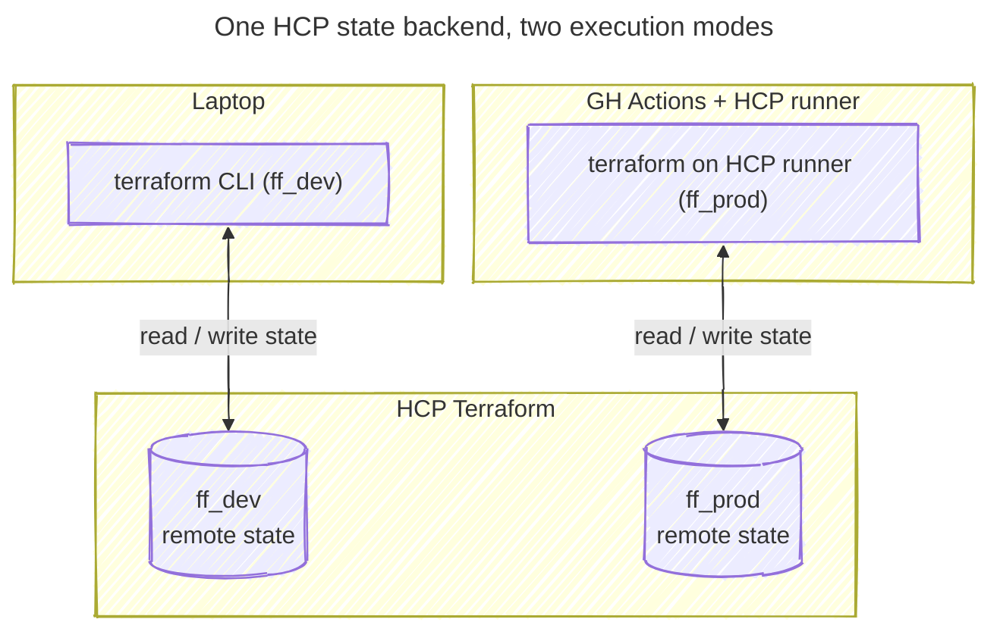

# Use HCP Terraform as the state backend for all workspaces

**Status:** Accepted | **Date:** 2026-04-23

## Context and Problem Statement

Terraform manages this project's AWS infrastructure across two workspaces - [`ff_dev`](../terraform/ff_dev/) (local
execution) and [`ff_prod`](../terraform/ff_prod/) (remote execution). Terraform state has to live somewhere both the
laptop and CI can reach, and it has to be safe: state files can contain secrets in plain text. Local `.tfstate` files
are easy to commit by accident, don't travel between machines or into CI, and offer no locking. Where should Terraform
state live?

## Considered Options

- Local state files on disk
- HCP Terraform (Terraform Cloud) remote state

## Decision Outcome

Chosen option: "HCP Terraform remote state", because it gives portable, zero-bootstrap remote state with locking, run
history and a UI, and keeps nothing on the local filesystem. The same backend serves both workspaces with the state
strategy, so only the _execution mode_ varies (`ff_dev` runs `terraform` on the laptop, `ff_prod` runs it on an HCP
runner VM).

The idea of local state was rejected on the basis of security: state on disk is one `git add .` away from being
committed and personal laptops may get compromised.

### Consequences

- Good, because no `.tfstate` ever lands on disk, so there is no risk of committing state or the secrets it may contain
  (`.gitignore` still excludes `*.tfstate*` as defence in depth)
- Good, because the config is portable: the org name is injected via `TF_CLOUD_ORGANIZATION`, nothing is hardcoded
- Good, because state locking, run history and an inspection UI come for free, with no bootstrap infrastructure to
  provision
- Good, because one consistent state strategy covers both workspaces; `ff_prod`'s remote execution builds naturally on
  the same backend
- Bad, because it adds an external SaaS dependency - an HCP account is required to run anything
- Bad, because of onboarding friction: `terraform login` must be run once and `TF_CLOUD_ORGANIZATION` must be exported
- Bad, because it couples the project to HCP's workspace model and free-tier limits

## More Information

- Backend configuration: the `cloud {}` blocks in [`ff_dev/main.tf`](../terraform/ff_dev/main.tf) and
  [`ff_prod/main.tf`](../terraform/ff_prod/main.tf).
- Setup and execution-mode details: the [Terraform section of the README](../../README.md#terraform).

