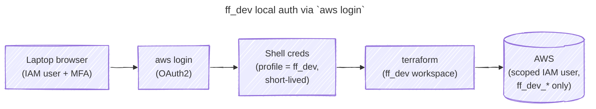

# Use `aws login` for AWS auth in the `ff_dev` Terraform workspace

**Status:** Accepted | **Date:** 2026-04-29

## Context and Problem Statement

The [`ff_dev`](../terraform/ff_dev/) workspace runs `terraform` locally on the laptop (see
[ADR 002](./002_terraform_directory_and_workspace_layout.md)), so every `plan` / `apply` needs AWS credentials present
in the shell. The AWS provider in [`ff_dev/main.tf`](../terraform/ff_dev/main.tf) reads them via a named profile
(`profile = "ff_dev"`). How should the laptop authenticate to AWS for `ff_dev` without long-lived access keys, and
without dragging in the full OIDC + HCP runner machinery that `ff_prod` uses for every change?

## Considered Options

- Long-lived IAM access keys in `~/.aws/credentials`
- `aws login` (AWS CLI v2.32.0+, Nov 2025) browser-based OAuth2 flow against a dedicated IAM user with a scoped policy
- OIDC + remote HCP execution, mirroring the `ff_prod` pattern

## Decision Outcome

Chosen option: "`aws login` + dedicated IAM user with a scoped policy", because it gives short-lived, browser-MFA'd
credentials with no secrets at rest on the laptop, while keeping the dev feedback loop tight. The IAM user has Console
login enabled so `aws login` can complete via the browser; the scoped policy lives at
[`fragments/terraform/ff_dev/tf_local_iam_policy.json`](../terraform/ff_dev/tf_local_iam_policy.json) and is narrowed to
specific AWS services and actions on `ff_dev_*` resources only — least-privilege, matching the posture already used by
`ff_prod`'s plan/apply roles.

The rejected options lost on:

- Long-lived access keys — credentials at rest on disk, no MFA on the credential itself.
- OIDC + remote HCP for dev — the per-change round-trip through an HCP runner adds latency and ceremony that hurts
  iteration speed; dev does not need prod-grade isolation.

### Consequences

- Good, because no long-lived credentials live anywhere — only short-lived OAuth2-issued creds in the active shell
  session
- Good, because browser MFA is required on every `aws login`; the IAM user is gated by Console MFA
- Good, because the dev feedback loop stays tight — no HCP runner round-trip per change
- Good, because the IAM scope is purposely narrow, matching the least-privilege posture used in `ff_prod`
- Bad, because the IAM user, Console login, and policy are provisioned by hand via the root user and live outside
  Terraform — bootstrapping IAM with Terraform would be circular
- Bad, because adding a new resource type (Lambda, RDS, etc.) needs a manual root-user edit to the policy before
  `terraform apply` will succeed — friction grows with surface area

## More Information

- Scoped policy: [`fragments/terraform/ff_dev/tf_local_iam_policy.json`](../terraform/ff_dev/tf_local_iam_policy.json)
- Named-profile wiring in the provider: [`fragments/terraform/ff_dev/main.tf`](../terraform/ff_dev/main.tf)
- Related: [ADR 001](./001_hcp_terraform_state_backend.md) (state backend),
  [ADR 002](./002_terraform_directory_and_workspace_layout.md) (per-env roots and execution-mode asymmetry)

