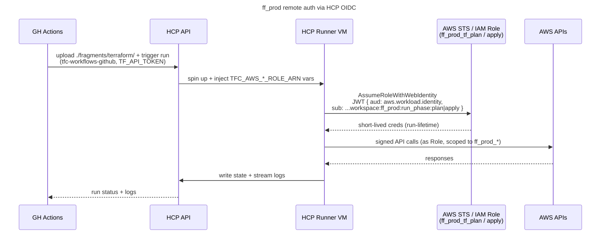

# Use OIDC + HCP runner for AWS auth in the `ff_prod` Terraform workspace

**Status:** Accepted | **Date:** 2026-05-09

## Context and Problem Statement

The [`ff_prod`](../terraform/ff_prod/) workspace runs `terraform` remotely on an HCP-managed runner VM (see
[ADR 002](./002_terraform_directory_and_workspace_layout.md)), triggered by GitHub Actions via the HCP API in
[`terraform_deploy.yml`](../../.github/workflows/terraform_deploy.yml). The runner needs AWS credentials for every
`plan` and every `apply`. How should it authenticate to AWS without a long-lived AWS secret sitting in GitHub, HCP, or
the repo?

## Considered Options

- Long-lived IAM access keys stored as sensitive HCP workspace variables
- Long-lived IAM access keys stored as GitHub Actions secrets and forwarded into HCP at run time
- OIDC trust between HCP and AWS, with separate scoped IAM roles for `plan` and `apply`, assumed via
  `AssumeRoleWithWebIdentity` and short-lived STS credentials

## Decision Outcome

Chosen option: "OIDC + separate plan/apply roles", because it removes any AWS credential at rest and lets the trust
policy itself enforce who can assume the roles. The HCP AWS provider integration is wired with the workspace variables
`TFC_AWS_PROVIDER_AUTH=true`, `TFC_AWS_PLAN_ROLE_ARN`, and `TFC_AWS_APPLY_ROLE_ARN`, so no provider code change is
needed per role.

The role trust policies ([`tf_remote_iam_plan_role.json`](../terraform/ff_prod/tf_remote_iam_plan_role.json),
[`tf_remote_iam_apply_role.json`](../terraform/ff_prod/tf_remote_iam_apply_role.json)) pin the OIDC claims to
`aud=aws.workload.identity` and a full `sub` tuple
(`organization:pjlangley:project:pjlangley_ff:workspace:ff_prod:run_phase:<plan|apply>`), so a JWT minted for any other
org, project, workspace, or phase is rejected. The permission policies
([`tf_remote_iam_plan_policy.json`](../terraform/ff_prod/tf_remote_iam_plan_policy.json),
[`tf_remote_iam_apply_policy.json`](../terraform/ff_prod/tf_remote_iam_apply_policy.json)) keep `plan` read-only and
scope `apply` to specific AWS services and actions on prod resources only — matching the `name_prefix` from
[`locals.tf`](../terraform/ff_prod/locals.tf). A `plan`-phase compromise cannot mutate AWS, and an `apply`-phase
compromise cannot touch anything outside `ff_prod_*` in `eu-west-2`.

The trigger path adds defence in depth: the `terraform_deploy.yml` workflow only runs `apply-run` from a `ff_prod`
GitHub environment that is restricted to `main` and requires a reviewer approval.

The rejected options lost on:

- Long-lived keys in HCP or GH secrets — would put an AWS credential at rest and require calendar rotation, with no
  per-phase scoping built in.

### Consequences

- Good, because STS credentials are ephemeral (run-lifetime) — the AWS side of the auth path holds nothing persistent
- Good, because trust-policy claim pinning (`aud` + full `sub` tuple) is enforced by AWS, not by HCP, so a JWT minted
  for any other org/project/workspace/phase is refused at the AWS STS boundary
- Good, because `plan` and `apply` are split into separate roles with separate permissions — a `plan`-phase compromise
  cannot mutate AWS
- Good, because the GH environment gate (required reviewer + `main`-only branch restriction) protects against an
  unauthorised CI trigger of `apply`
- Bad, because bootstrap is fully manual (OIDC IdP, two roles, two policies, HCP workspace + variables, team API token,
  GH secret, GH environment) — bootstrapping AWS auth in Terraform would be circular, the same trade-off as
  [ADR 003](./003_aws_login_auth_for_ff_dev_workspace.md)
- Bad, because the HCP team API token `ff_prod_ci` (1-year expiry, stored as GH secret `TF_API_TOKEN`) is a long-lived
  credential and needs calendar rotation
- Bad, because adding a new AWS service to `ff_prod` requires manual edits to both plan and apply policies before
  `apply` will succeed — friction grows with surface area

## More Information

- HCP dynamic provider credentials (AWS):
  <https://developer.hashicorp.com/terraform/cloud-docs/dynamic-provider-credentials/aws-configuration>
- HCP team API tokens:
  <https://developer.hashicorp.com/terraform/cloud-docs/users-teams-organizations/api-tokens#team-api-tokens>
- One-time manual bootstrap is recorded under [`README.md` → Terraform → Remote → Setup](../../README.md): the OIDC
  identity provider, both IAM roles and policies, the HCP workspace and its variables, the `ff_prod_ci` team API token,
  the `TF_API_TOKEN` GH secret, and the `ff_prod` GH environment with its reviewer and branch restriction
- API-driven GH Actions workflow: [`terraform_deploy.yml`](../../.github/workflows/terraform_deploy.yml) uses
  `hashicorp/tfc-workflows-github/actions/{upload-configuration,create-run,plan-output,apply-run}`
- Related: [ADR 002](./002_terraform_directory_and_workspace_layout.md) (per-env roots and execution-mode asymmetry),
  [ADR 003](./003_aws_login_auth_for_ff_dev_workspace.md) (the `ff_dev` counterpart using `aws login`)

