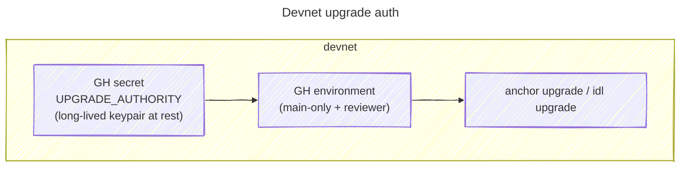

# Store the devnet deployer keypair as a GitHub Actions secret

**Status:** Accepted | **Date:** 2026-06-24

## Context and Problem Statement

The `register` program's devnet upgrades are automated by
[`solana_deploy.yml`](../../.github/workflows/solana_deploy.yml), which runs `anchor upgrade` and `anchor idl upgrade`
(see [ADR 007](./007_upgradeable_solana_programs.md)). Both are signed by the program's **upgrade authority** — the
`devnet_deployer.id.json` keypair. CI therefore needs the full keypair material at run time. Where should that keypair
live so that automated upgrades can sign, given that the initial bootstrap is manual (see
[`README.md` → Devnet](../../README.md)) and the program runs only on devnet?

## Considered Options

- A long-lived GitHub Actions secret in a gated `ff_solana_devnet` GitHub environment
- OIDC trust between GitHub Actions and AWS, fetching the keypair from AWS Secrets Manager at run time (mirroring the
  `ff_prod` OIDC pattern in [ADR 004](./004_oidc_auth_for_ff_prod_workspace.md))

## Decision Outcome

Chosen option: "long-lived GitHub Actions secret in a gated environment", because the mechanism is calibrated to the
blast radius, not to a generic "best practice". A devnet upgrade authority authorises nothing of value: it can only
upgrade a program on a network whose tokens are worthless and whose state is disposable. Spending the OIDC + Secrets
Manager ceremony here would buy a slower feedback loop and more moving parts for **zero** risk reduction.

The keypair is stored as the secret `SOLANA_DEVNET_UPGRADE_AUTHORITY` (full contents of `devnet_deployer.id.json`),
alongside `HELIUS_API_KEY`, in the `ff_solana_devnet` GitHub environment. The environment is the gate that does the real
work: it is restricted to `main` and requires a manual reviewer approval before the secret is ever exposed to a job. The
workflow is additionally change-gated (it only runs when `register` files change) and runs a balance preflight before
any upgrade.

This is deliberately a different posture from the project's other two auth paths, and the distinction is the point:

- [ADR 003](./003_aws_login_auth_for_ff_dev_workspace.md) (`ff_dev`) uses `aws login` — short-lived credentials, nothing
  durable at rest. It avoids a stored secret.
- This decision **tolerates** a long-lived static secret. A keypair is durable material by nature (it cannot be
  exchanged for a short-lived token the way an OIDC federation issues STS creds), so the secret exists at rest in
  GitHub. That is acceptable here precisely because the secret protects nothing of value.

So both dev-grade choices are correctly lightweight, but for different reasons — one avoids a stored secret, the other
tolerates a worthless one.

### The escalation threshold

The line to escalate is the **mainnet boundary**, where the upgrade authority would control a program holding real
value. At that point a long-lived keypair sitting in GitHub becomes an unacceptable credential at rest.

### Consequences

- Good, because the mechanism matches the blast radius — no OIDC + Secrets Manager ceremony for a credential that
  authorises nothing of value, keeping the upgrade feedback loop tight
- Good, because the `ff_solana_devnet` environment gate (required reviewer + `main`-only) means the secret is only
  exposed to an approved run on the default branch
- Good, because the escalation threshold (the mainnet boundary) and the target mechanism are written down, so the choice
  reads as a calibrated judgement rather than an unexamined default
- Bad, because the keypair is a long-lived static secret at rest in GitHub — exactly what OIDC exists to eliminate; it
  is only safe here because devnet value is nil, and it needs manual rotation if ever exposed
- Bad, because the bootstrap and any rotation are manual (keygen, faucet funding, secret upload)
- Bad, because devnet and a future mainnet use two different auth mechanisms, so the mainnet cutover is net-new work,
  not a config flip

## More Information

- Manual bootstrap and CI/CD upgrade flow: [`README.md` → Devnet](../../README.md)
- Related: [ADR 005](./005_helius_rpc_provider_for_devnet.md) (devnet RPC),
  [ADR 006](./006_deploy_solana_programs_to_devnet.md) (devnet target), [ADR 007](./007_upgradeable_solana_programs.md)
  (upgrade-in-place — why an upgrade authority exists at all), [ADR 004](./004_oidc_auth_for_ff_prod_workspace.md) (the
  OIDC pattern the mainnet boundary could adopt, with a different IdP)

