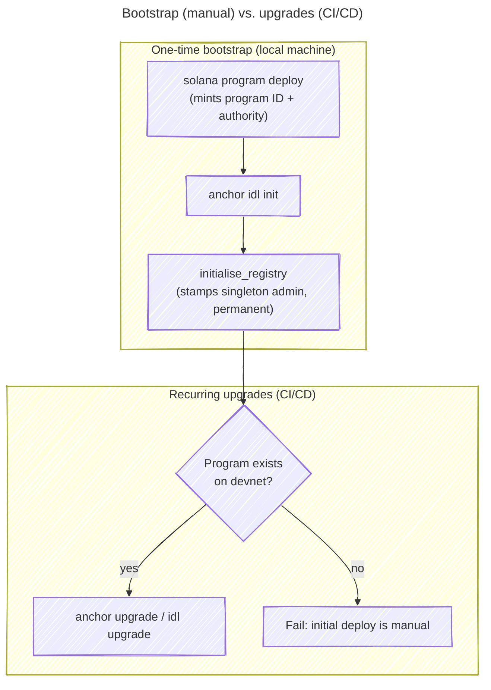

# Bootstrap the initial devnet program deploy and initialisation manually from the local machine

**Status:** Accepted | **Date:** 2026-06-24

## Context and Problem Statement

The `register` program's first appearance on devnet involves two one-time, irreversible steps: the **initial program
deploy** (which mints the program ID and sets the on-chain upgrade authority) and the **`initialise_registry` call**
(which creates the singleton `registry_state` PDA and permanently stamps the signer as the registry `authority`/admin).
Subsequent bytecode/IDL changes are upgrades, not first deploys. Should these one-time bootstrap steps be automated in
CI/CD alongside the upgrades, or performed manually from the developer's local machine?

## Considered Options

- Manual bootstrap from the local machine, then CI/CD for all subsequent upgrades
- Fully automate the bootstrap (initial deploy + initialisation) in CI/CD as well

## Decision Outcome

Chosen option: "Manual bootstrap from the local machine", because the bootstrap is a rare, one-shot, hard-to-reverse
event whose two side effects are foundational and permanent. The initial deploy fixes the program ID and writes the
upgrade authority; `initialise_registry` is guarded so it can only be signed by that upgrade authority, and whichever
key signs becomes the registry admin **forever** — it is the only account that can thereafter confirm registrations (see
[`register/src/lib.rs`](../blockchain/solana/programs/register/src/lib.rs) `InitialiseRegistry`). Performing this by
hand keeps a human in the loop for the irreversible decisions (which keypair holds authority, confirming the program
doesn't already exist) and lets us verify each step interactively before the next. Automating a step that runs once per
program lifetime would mean building and securing CI plumbing that does not recur, with no payoff in feedback-loop
speed.

CI/CD owns the part that _does_ recur. Once the program exists on devnet, all program and IDL **upgrades** are automated
by [`solana_deploy.yml`](../../.github/workflows/solana_deploy.yml), which is change-gated, runs a balance preflight,
and refuses to run if the program isn't already deployed (the initial deploy stays manual by design). This split relies
on the program being upgradeable in the first place (see [ADR 007](./007_upgradeable_solana_programs.md)).

### Consequences

- Good, because the irreversible, one-shot decisions (program ID, upgrade authority, singleton registry admin) are made
  deliberately by a human who verifies each step before proceeding
- Good, because we avoid building and securing CI plumbing for an event that runs only once per program lifetime
- Good, because the recurring work (upgrades) is still fully automated, keeping the day-to-day feedback loop tight
- Bad, because the bootstrap is manual and therefore not reproducible by a pipeline — it depends on documented README
  steps and the operator following them correctly
- Bad, because the deployer/authority keypair is handled locally during bootstrap, so its initial custody is a manual
  responsibility

## More Information

